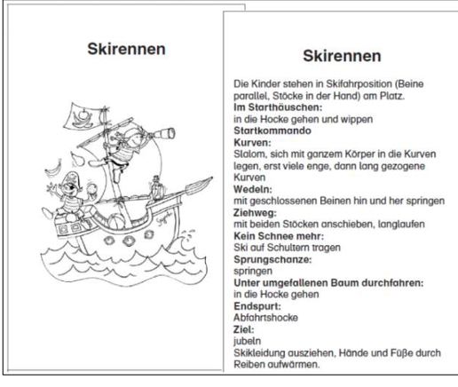
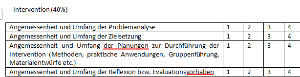

```{r setup}
# if (!requireNamespace("needs"   )) install.packages("needs")
# if (!requireNamespace("excelbib")) install_github("Enno-W/excelbib")
 needs("excelbib", "xfun")
 xlsx_to_bib(from_root("References.xlsx"))
```

# Agenda

- PVL: **Zoé Sommer (Gruppe B)**

- Input zur Materialentwicklung

- Interaktives Quiz

- Erarbeitung der Materialien in den Gruppen

# PVL

Ziel: Häufigere Anwendung von Copingstrategien gegen chronische Schmerzen einer:s Athlet:in. 

Inhalt: Konkrete Teilzielformulierungen in einer (einfachen) **Matrix der Veränderungsziele (Handlungsziel x Determinante)**.

## PVL - Auftrag an die Mitstudierenden

- Meldet euch als Freiwillige:r für die Zielsetzungs-Übung. In diesem Rollenspiel geht es nur um ein "so tun, als ob". Es muss also nicht wahrheitsgemäß gespielt werden.

- Hört aufmerksam zu und stellt am Ende evtl Rückfragen und gebt Feedback.

# Logisches Modell der Intervention


# Programmentwicklung: Vom Plan zum Produkt

::: notes
- Jetzt wird es praktisch: Wir entwickeln Apps, Flyer, Kursmanuale oder Videos.
- Wichtig: Eine App bringt nichts, wenn die Zielgruppe (z. B. Hochbetagte) keine Smartphones nutzt.
- Die Methoden aus Schritt 3 müssen "instrumentalisiert" werden.
- **Anpassung:** Materialien müssen sowohl zur **Zielgruppe** (z. B. Smartphone-kompetent?) als auch zu den **Umsetzenden** (z. B. Trainer/Lehrkräfte) passen.
:::

## Vorgehen zur Materialentwicklung

**Option 1:** Je eine Methode und praktische Anwendung vornehmen, Programmkomponente dazu entwickeln.

**Option 2:** Die bisherigen Tabellen und Notizen beiseite legen, bisherige Programmideen brainstormen, dann periodisch prüfen, ob die Ideen zu der Planung passen.

## Kernfragen zur Überprüfung

- Werden die theoretischen Methoden und praktischen Anwendungen genutzt?

- Erlauben die Programmkomponenten, dass die Veränderungsziele erreicht werden?

- Passen die Materialien zur Zielgruppe?

- Sind die Materialien ansprechend und kulturell relevant?

- Ist der Inklusion aller Individuen in der Zielgruppe Rechnung getragen?

## Kernbegriffe

- **Umfang & Ablauf:** Wie intensiv ist das Programm? Laufen Module parallel oder nacheinander?
- **Kommunikationskanal:** Das Medium (z. B. persönlicher Kontakt, Website (erstellt mit Quarto? 😉), Print).
- **Kommunikationsvehikel:** Die Verpackung (z. B. Interview, Talkshow, Handbuch).
- **"Theme" (Thema):** Ein roter Faden (z. B. "Pirat:innenthema") für Kinder.

::: notes
- Ein Radiointerview (Kanal) eignet sich nicht für "Angeleitete Übung" (Methode).
- Das Thema hilft, die Zielgruppe emotional abzuholen und eine Identität zu schaffen.
:::

# Kommunikation

## Verständlich schreiben

### Textgestaltung und Wortwahl

- **Aktiv statt Passiv** (z. B. "Schreibe kurz" statt "Es sollte kurz geschrieben werden").
- **Schwere Begriffe erklären**
- **Visuelle Signale** wie Fettdruck, Symbole und Zwischenüberschriften.
- **Logische Ordnung** der Inhalte
- **Keine überflüssigen Inhalte**, die nicht direkt zu den Veränderungszielen beitragen.
- **Advance Organizers**
- **Starke Kernsätze** am Anfang jedes Absatzes.
- [ ] Checkboxen wie diese, um Interaktion zu fördern.

::: notes
- Das sind konkrete Gestaltungsregeln für die Praxis (Materialentwicklung).
- Die Folie selbst nutzt diese Prinzipien: Aktive Verben am Anfang, Zwischenüberschriften, Checkboxen zum Mitdenken.
:::

## Produktion & Qualitätssicherung

- **Briefing:** Externe Fachkräfte müssen z.B. die Wirkparameter kennen
- **Prätest:** Einzelteile prüfen (Verständlichkeit, Ästhetik, Wirkung auf Determinanten, Erinnerung überprüfen ...).
- **Pilotversuch:** Das Programm im Testlauf

::: notes
- Als Psychologen müssen wir den Designern sagen: "Das Vorbild im Video darf nicht zu perfekt sein, es muss Hürden überwinden."
- Prätest verhindert peinliche Fehler oder Unverständnis.
:::

# Praxisbeispiel

## "Komm mit ins gesunde Boot" [@Wartha2016; @znl_komm_mit_2025]

Programmziel: Reduktion von Übergewicht im Kindergartensetting.

Verhaltensziele: Bewegungsförderung, Reduktion des Medienkonsums, Förderung des Obst- und Gemüsekonsums, Minimierung des Konsums zuckerhaltiger Getränke.

Methoden: Modeling, Wissensvermittlung, Belohnung, Zielsetzung

Praktische Anwendungen: Bewegunsstunden, Ernährungs- und Freizeiteinheiten, Elternarbeit

## Material zum Thema Bewegung am Beispiel "Komm mit ins gesunde Boot"

- Piratenkinder "Finn und Fine" als Identifikationsfiguren.
- Modeling anhand von Geschichten, die vorgelesen oder mit Handpuppen gespielt wurden.
- Bewegungswürfel
- Präsentation zu bewegten vs. unbewegten Tätigkeiten und Sportarten
- Papierflieger-Anleitung
- Bewegungsübungen-Anleitung
- Freizeitampel zur Unterscheidung von bewegten vs. unbewegten Tätigkeiten
- Piratenfrisbee-Anleitung
- Bastelanleitung zur Wasserspritzflasche
- 56 **Bewegungskarteikarten**
- Kopiervorlagen für sechs **Elternbriefe** auf Deutsch, Türkisch und Russisch

::: notes
- Hier sieht man die Kette: Verhaltensziel (Bewegung) -\> Methode (Modeling) -\> Anwendung (Handpuppen Finn & Fine).
- Die Bewegungskarten senken die Barriere für die Erzieher (Umsetzende).
:::

## Bewegungs-Karteikarte [@wartha_komm_mit_2018]



Komplette Materialien unter <https://www.gesundes-boot.de/materialien/> erhältlich.

## Finn und Fine


Quelle: @znl_komm_mit_2025

# Hausarbeit

- Egal welches Thema: Die Durchführung und Evaluation der Intervention soll planerisch skizziert sein –\> Keine Wort-für-Wort-Ausarbeitung nötig. (Modulbeschreibung: "**kennen** und **beherrschen**".)
- Erstellen von Interventionsmaterialien (1&4) - Einsatz von KI für Poster, Videos etc. ist in Ordnung.



# Quizlet- Quiz

[Link hier](https://quizlet.com/1190674367/live?type=blast)

# Übung: Arbeitsblatt zur Materialentwicklung

::: notes
- Die Studierenden sollen hier kreativ werden, aber die vorherigen Schritte im Hinterkopf behalten.
:::

## Kommunikationspräferenzen im Vergleich

| Individualistisch | Kollektivistisch |
|:-----------------------------------|:-----------------------------------|
| **Fokus auf Kompetenz** <br> Wichtig sind Expertenwissen, Glaubwürdigkeit und Intellekt. | **Fokus auf Beziehung** <br> Wichtig sind Familie, Alter, Status und die Hierarchie in der Gruppe. |
| **Direkte Argumentation** <br> Das Beste kommt zuerst (antiklimaktisch). Fakten führen zur Schlussfolgerung (induktiv). | **Indirekte Argumentation** <br> Behutsamer Aufbau (klimaktisch). Die Schlussfolgerung steht am Anfang (deduktiv). |
| **Präzise Sprache** <br> Hohe Detailgenauigkeit, Fokus auf den exakten Wortlaut. | **Kontextuelle Sprache** <br> Nutzung von Intuition, bewusster Vagheit und Andeutungen. |
| **Unabhängigkeit** <br> Die Meinung von Hierarchien spielt eine untergeordnete Rolle. | **Gemeinschaft & Präsenz** <br> Braucht persönlichen Kontakt (Face-to-Face) und mehr nonverbale Signale. |

::: notes
:::

::: notes
- Bei der Materialentwicklung (z. B. für internationale Zielgruppen oder Migrationskontexte) muss dieser kulturelle Hintergrund beachtet werden.
- Ein rein faktenbasierter, direkter Flyer (individualistisch) läuft bei kollektivistisch geprägten Zielgruppen eventuell ins Leere.
:::

# Literaturverzeichnis

::: refs
:::
