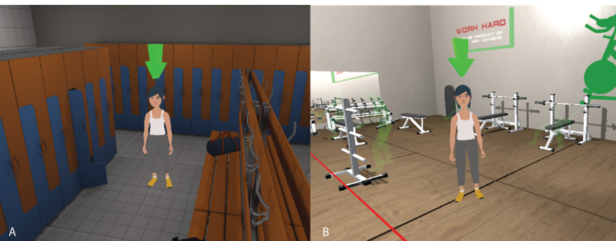

```{r setup}
# if (!requireNamespace("needs"   )) install.packages("needs")
# if (!requireNamespace("excelbib")) install_github("Enno-W/excelbib")
# needs("excelbib", "xfun")
# xlsx_to_bib(from_root("References.xlsx"))
```

## Agenda

- PVL (Gruppe A: Lukas Triebs; Gruppe B: Paul Möller)
  - Gruppe B: Erinnerung Abgabe der Verschriflichung (Zoé)

- Input zu Intervention Mapping Schritt 5 - Annahme und Umsetzung

- Interaktives Quiz

- Gruppenarbeitsphase

# PVL 

## Situation

Ein Rehabilitationszentrum möchte die Compliance von Patient:innen nach einer Kreuzband-OP bei den physiotherapeutischen Hausaufgaben erhöhen. Die **Interventionsplanung** ist bereits fortgeschritten. „Nudging“ (z. B. Erinnerungen per App) ist als theoretische Methode in der engeren Auswahl gelandet.

## Auftrag an die Zuhörenden

- Hört aufmerksam zu und stellt ggf. Fragen
- Bringt euch in die Diskussion ein: Ihr seid Physiotherapeut:innen im Reha-Zentrum, und es geht um die Compliance bei Physio-Hausaufgaben. Diskutiert kritisch mit dem Interventionsteam (den Präsentierenden), wie die Methode "Nudging" konkret angewendet werden kann. 
- Gebt am Ende eine Rückmeldung zur PVL. 

# Intervention Mapping Schritt 5 - Annahme und Umsetzung

## Kernfragen

- Wer entscheidet darüber, das Programm umzusetzen?
- An wen wenden sich die Entscheidungsträger:innen?
- Wer setzt das Programm um?
- Erfordert das Programm verschiedene Personen, um die Programmkomponenten umzusetzen?
- Wer stellt sicher, dass das Programm so lange weiterläuft, wie es nötig ist?

::: notes
- Wir haben jetzt ein tolles Programm (Schritt 4). Aber wie kommt es in die Klinik/den Verein/die Schule?

- Wir müssen die "Gatekeeper" (Entscheider) gewinnen.
:::

## Standard der Umsetzung


Umsetzende müssen Methoden und praktische Anwendungen...

- ... korrekt (Umsetzungsgenauigkeit/Fidelity)

- ... vollständig (Vollständig/completeness)

- ... und in angemessener Dosis (dose) einsetzen.

## Zielsetzung: Programm- und Handlungsziele

Aus den Leizsätzen ergeben sich *Programmziele* zu: (1) Annahme (2) Umsetzung (3) Nachhaltigkeit

- Daraus leitet das Interventionsteam *Handlungsziele* ab, die mit Determinanten gekreuzt werden (Schritt 1-4 werden für die Annehmenden und Umsetzenden erneut durchlaufen)

::: notes
- Wichtig: Ein Schulleiter (Annehmer) führt den Sportkurs meist nicht selbst durch (Umsetzer). Beide brauchen unterschiedliche Motivationen.
:::

# Praxis-Einblicke

## Die Matrix für Umsetzende im Programm "Komm mit in das gesunde Boot" (gekürzt)[@Wartha2016]

| Handlungsziel (Erzieher...) | Wissen | Selbstwirksamkeit |
|:-----------------------|:-----------------------|:-----------------------|
| **...entscheiden sich zur Umsetzung** | Wissen, dass das Programm existiert. | Äußern, dass sie glauben, die Umsetzung zu schaffen. |
| **...führen Komponenten korrekt aus** | Benennen alle Komponenten. | Bewerten sich als fähig zur korrekten Durchführung. |

::: notes
- Wir wenden hier die Schritte 1-4 des IM erneut an: Wir erstellen Matrizen für die Umsetzer!
- Was müssen die Erzieher tun (Handlungsziele) und was hält sie davon ab (Determinanten)?
:::

## "Komm mit in das gesunde Boot" - Multiplikatorenansatz

- **Strategie:** Pro Bezirk werden zwei Erzieher als **Multiplikatoren** ausgebildet.
- **Vorteile:**
  - Reduziert Kosten (keine externen Fachkräfte nötig).
  - Kommunikation "auf Augenhöhe" (Erhöht Akzeptanz & Selbstwirksamkeit).
  - Vorhandene Netzwerke werden genutzt.
- **Nachhaltigkeit:** Das Programm wird durch die interne Kompetenz im Kindergartenalltag verankert.

## ViRAL-Projekt - Beispiel für den "shelf-effect"

- VR-App gegen Doping

- Work package "[Dissemination](https://viraltheproject.aau.dk/index.php/news/)"

- Präsentationen und Demonstrationen durch Beteiligte WiMis im Projekt

- "Train the trainers"

- Problem: Verfügbarkeit der App nach Projektende nicht gegeben, kein Plan für "danach".

  

::: notes
- Multiplikatoren wirken auf die Determinanten: Wissen, Fähigkeiten und vor allem die Einstellung der Kollegen.
:::

# Weitere praktische Überlegungen

## Gegenseitige Anpassung (mutual adaptation)

- Programme werden von den umsetzenden Institutionen in etwa der Hälfte der Fälle angepasst
- Vorhersagbarer und positiver Prozess, daher:
- den Prozess für die Institutionen vereinfachen
- gleichzeitig die Wirksamkeit der Intervention nicht aus dem Blick verlieren

## Shelf-Effect

- Plan für die Zeit nach Vollendung der Programmentwicklung unzureichend
- z.B. wird die Intervention als Belastung für Personal wahrgenommen
- oder das Interventionsmaterial ist schwer zugänglich, Instruktionen nicht ausreichend detailliert etc.

# Quiz

Link [hier](https://quizlet.com/1191851045/live?type=classic)

# Hausarbeit

## Skizzierung von Schritt 5

Implementierungskonzept anhand folgender Leitfragen:

**Annahme:** Wer sind die wichtigsten annehmenden Personen und wie überzeugt ihr sie?

**Umsetzung:** Wie stellt ihr sicher, dass das Personal das Programm korrekt und vollständig umsetzt? (z. B. durch eine einmalige Kurzschulung, Checklisten oder einen Multiplikatorenansatz)

**Nachhaltigkeit:** Wie wird verhindert, dass das Programm nach ein paar Monaten wieder einschläft? (z. B. Verankerung in vorhandenen Institutionen, Handbuch für BGM-Mitarbeitende).

## Arbeitsblatt

# Literaturverzeichnis

::: refs
:::
