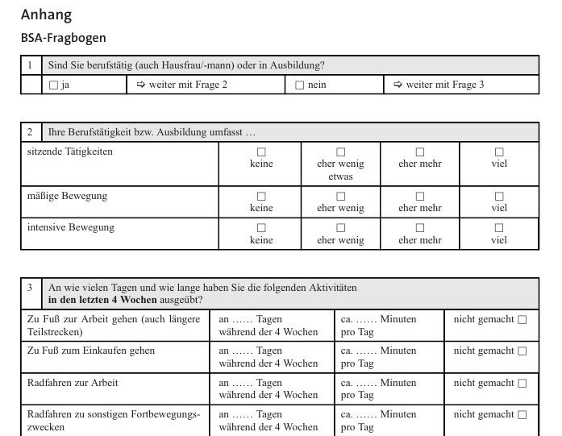
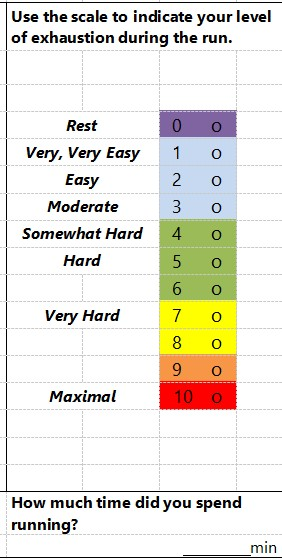

```{r setup}
#| echo: false
# if (!requireNamespace("needs"   )) install.packages("needs")
# if (!requireNamespace("excelbib")) install_github("Enno-W/excelbib")
 needs("excelbib", "xfun")
 xlsx_to_bib(from_root("References.xlsx"))
```

# Agenda

-   Organisationsfragen
-   Definitionen von physischer Aktivität (PA)
-   Messmethoden: Von Doubly-Labeled-Water bis Fragebogen
-   Fitnesstest: Praxisbeispiel
-   Gruppenarbeit: Steckbrief einer Messmethode
-   Hausarbeitsthemen

## Orga

- Gruppenwechsel
- Hausarbeitsthemen

# Rückblick

[Gruppe B](https://moodle2.uni-leipzig.de/mod/etherpadlite/view.php?id=3175741)

[Gruppe A](https://moodle2.uni-leipzig.de/mod/etherpadlite/view.php?id=3175745)

Wie trackt ihr eure Aktivität?

-   App?
-   Gedächtnis?
-   Tagebuch?

# Definition von physischer Aktivität (PA)

## Die mechanistische Perspektive

-   Klassische Definition: Aktivität der Skelettmuskeln mit Energieumsatz [@caspersen1985physical].
-   Spezifizierung: Es muss eine *Steigerung* des Energieumsatzes vorliegen [@hollmann2009sportmedizin].
-   Vorteil: Klare Operationalisierung für biologische Studien.

::: notes
-   Einstiegsfrage: Warum definieren wir das überhaupt?
-   Mechanistisch bedeutet: Mensch als Maschine.
-   Krug et al. [-@Krug2013] nutzen PA und körperliche Aktivität oft synonym.
:::

## Die Kritik am Reduktionismus

-   Nur auf Energieumsatz zu schauen, ist "reduktionistisch" [@Piggin2020].
-   Vernachlässigt das komplexe Erleben und das Verhalten.
-   Widerspricht einer ganzheitlichen Betrachtung.

::: notes
-   Was fehlt bei der mechanistischen Sicht? (Spaß, soziale Interaktion, Kultur).
-   Überleitung zum biopsychosozialen Ansatz.
:::

## Der biopsychosoziale Ansatz

-   Abgrenzung zum biomedizinischen (defizitorientierten) Ansatz.
-   Integration von drei Ebenen [@Engel1977]:
    1.  **Biologisch** (Energieumsatz, Genetik)
    2.  **Psychisch** (Affekt, Motive, Attribution)
    3.  **Sozial** (Beziehungen, Kontext)

::: notes
-   Warum ist das für Sportpsychologen wichtig?
-   Ohne die psychische Ebene können wir keine Interventionen planen (Intervention Mapping!).
:::

## Eine ganzheitliche Definition

> „Physical activity involves people moving, acting and performing within culturally specific spaces and contexts, and influenced by a unique array of interests, emotions, ideas, instructions and relationships.“\
> — @Piggin2020 (S. 5)

::: notes
-   Diese Definition bildet die Basis für unser Seminar.
-   Fokus auf: Emotionen, Ideen und Beziehungen.
:::

# Messmethoden physischer Aktivität


## Kategorisierung der Methoden [@Kohl2000]

-   **Direkt:** Körpermaße wie Herzfrequenz oder Schritte (objektiv).
-   **Indirekt:** Fragebögen, Umrechnung/Auswertung nötig (subjektiv).
-   **Kriteriumsmethoden:** Erfassung über des Energieumsatzes (DLW, Indirekte Kalometrie).

::: notes
-   Beispiel für indirekt: Herzfrequenzvariabilität -\> Rückschluss auf Intensität.
:::

## Validität vs. Anwendbarkeit

-   Systematisierung nach @Mueller2010:
-   **Hohe Validität** (Genauigkeit) = **Geringe Anwendbarkeit** (teuer, aufwendig).
-   Beispiel: *Doubly-Labeled-Water* (DLW).

::: notes
-   DLW: Isotope im Wasser, sehr genau für Energieumsatz, aber kostet tausende Euro pro Proband.
:::

## Subjektive Methoden: Fragebögen

-   **Vorteile:** Ressourcensparend, große Stichproben möglich.
-   **Nachteile:**
    -   Soziale Erwünschtheit.
    -   Erinnerungsverzerrung (*Recall Bias*).
-   **Eignung:** Gut für Gruppenvergleiche, schwierig für Individualdiagnostik [@Vanhees2005].

## Fragebogen Beispiel 1 - BSA-Fragebogen

@Fuchs2015




## Fragebogen Beispiel 2 - Session RPE

@Foster2001 @Foster2021



# Praxis-Input: Kapazitätstests bzws. Fitnesstests

- Physiologische Maße: Herzratenvariablität, VO~2~max, Laktat
- Wiederholung bestimmter Aufgaben, Erfassen Anzahl der Wiederholungen und Geschwindigkeit
  - [Praxisbeispiel](https://ennosgermancourse-my.sharepoint.com/:b:/g/personal/enno_winkler_spb-ew_de/IQA9yxTHNEy8Rp4MhxgjnhltAWAUZsE0nst60z2-gM4W70E?e=XgxHQ9) aus den Special Olympics
  ➝ Welche Aspekte der Fitness werden hier gemessen?
  ➝ Ist das Verfahren fair? Was könnte an dem Fitnesstest noch verbessert werden?
  

# Gruppenübung: Steckbrief

Findet euch in Gruppen von 3-4 zusammen.

Füllt den Steckbrief (zu finden auf der Kurs-Website) aus, so gut ihr könnt.

Ihr könnt euch aus @Mueller2010 ein Verfahren aussuchen oder andere Messverfahren für sportliche Aktivität recherchieren. 

# Plenum: Kontexte der Messung

## Kontext 1: Interventionsstudie mit großer Stichprobe

### Das Szenario

| Merkmal | Beschreibung |
|---------|--------------|
| **Fragestellung** | Zusammenhang zwischen Bewegungsverhalten und Herz-Kreislauf-Erkrankungen |
| **Stichprobe** | n = 10.000 Personen aus der Allgemeinbevölkerung |
| **Ressourcen** | Geringes Budget pro Person (ca. 5-10€) |
| **Personal** | Keine spezielle Schulung der Erhebenden möglich |
| **Dauer der Messung** | Einmalige Erhebung, ca. 15-20 Minuten pro Person |


## Kontext 2: Intervention mit älteren Menschen (80+ Jahre)

### Das Szenario

| Merkmal | Beschreibung |
|---------|--------------|
| **Fragestellung** | Effekt eines wöchentlichen Bewegungsprogramms auf die Alltagsaktivität |
| **Stichprobe** | n = 60 Personen, Durchschnittsalter 84 Jahre |
| **Besonderheit** | Leichte kognitive Einschränkungen (Erinnerungsvermögen eingeschränkt) |
| **Technikaffinität** | Mehrheit besitzt kein Smartphone |
| **Messzeitpunkte** | Vorher (T1) und nachher (T2) - 8 Wochen Intervention |


## Kontext 3: Validierungsstudie im Labor

### Das Szenario

| Merkmal | Beschreibung |
|---------|--------------|
| **Fragestellung** | Ein neuer Kurzfragebogen zur Bewegungsmessung soll validiert werden |
| **Konkret** | Sie wollen die **Kriteriumsvalidität** Ihres Fragebogens prüfen |
| **Stichprobe** | n = 30 gesunde Erwachsene |
| **Setting** | Kontrollierte Laborumgebung |
| **Ressourcen** | Ausreichend Budget für hochpräzise Messungen vorhanden |

## Kontext 4: Intervention mit Leistungssportler:innen

### Das Szenario

| Merkmal | Beschreibung |
|---------|--------------|
| **Fragestellung** | Zusammenhang zwischen Trainingsintensität und Regenerationsbedarf |
| **Stichprobe** | n = 20 Triathlet:innen im Wettkampftraining |
| **Messdauer** | 4 Wochen im normalen Trainingsalltag |
| **Anforderungen** | Echtzeit-Daten, hohe Genauigkeit, minimale Einschränkung |
| **Zielgrößen** | Intensität, Dauer, Häufigkeit der Belastung |

# Wissens-Check

Tretet dem [Spiel](https://quizlet.com/cn/1169077897/02-messung-von-pa-flash-cards/) auf Quizlet bei. 


<!-- # Gruppenübung: Der "selfBACK"-Check -->

<!-- -   Schauen Sie sich die Messmethode in der Studie von @Svendsen2022 an. -->

<!-- -   Wie wird dort Aktivität gemessen? -->

<!-- -   Wo ordnen Sie diese Methode im Schema von @Mueller2010 ein? -->

<!-- ::: notes -->

<!-- -   Die selfBACK Studie nutzt Smartphone-Sensoren/Apps. -->

<!-- -   Diskussion: Ist das eine direkte oder indirekte Methode? -->

<!-- ::: -->

# Literaturverzeichnis

::: refs
:::
