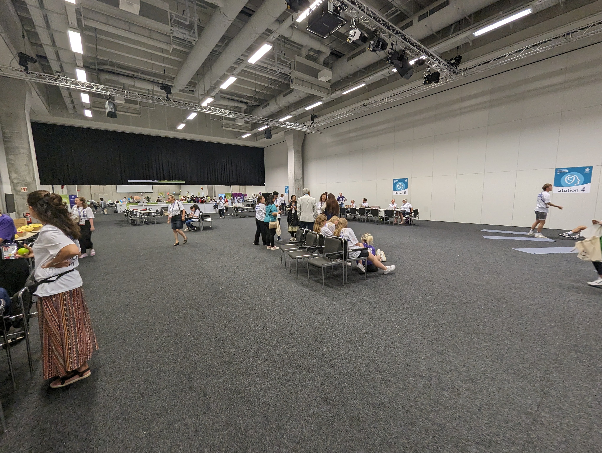
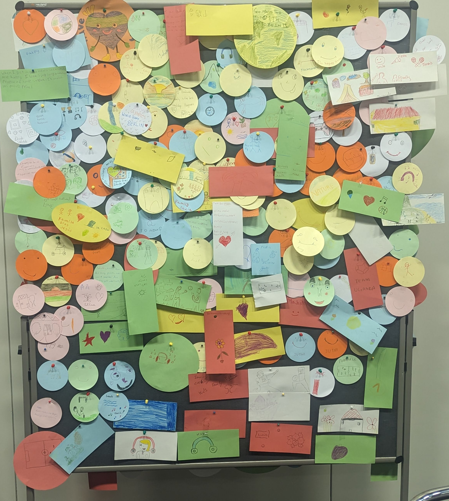
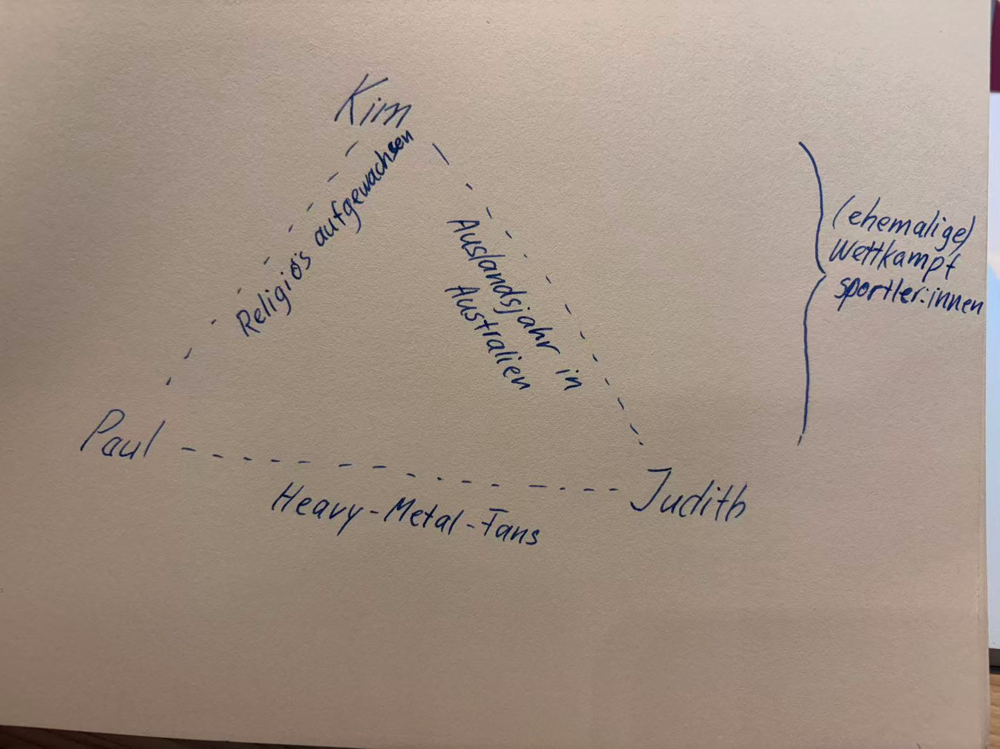

```{r setup}
# if (!requireNamespace("needs"   )) install.packages("needs")
# if (!requireNamespace("excelbib")) install_github("Enno-W/excelbib")
 needs("excelbib", "xfun")
xlsx_to_bib(from_root("References.xlsx"))
```

# Prüfungsvorleistung

Messung von PA im Kontext Schule

Aufgabe der Zuhörenden: Ihr seid Schulpersonal und hört eine Präsentation dazu, wie das Aktivitätsniveau der Schüler:innen gemessen werden soll. Viele Eltern beklagen sich über Bewegungsmangel der Kinder in der Schule. Stellt Fragen und diskutiert mit der präsentierenden Person über die beste Möglichkeit.

# Video

Schaut [Video 1](https://ennosgermancourse-my.sharepoint.com/:v:/r/personal/enno_winkler_spb-ew_de/Documents/Lehre%20%20So%20Se2026/Video_Park.mp4?csf=1&web=1&e=oNnFXB "Qigong-Video"); [Video 2](https://ennosgermancourse-my.sharepoint.com/:v:/g/personal/enno_winkler_spb-ew_de/IQDA-fx-Ba68R4xT8qWjp8tGAePb1kpb0h45z_Mm0GSs6GQ?e=P98vr8) und [Video 3](https://ennosgermancourse-my.sharepoint.com/:v:/r/personal/enno_winkler_spb-ew_de/Documents/Lehre%20%20So%20Se2026/Video_Kindergarten.mp4?csf=1&web=1&e=dTPcqN "Kindergarten Video") an.

Plenumsdiskussion: Welche Gemeinsamkeiten und Unterschiede zu hiesigen Formen der sportlichen Aktivitäten fallen euch auf? Was glaubt ihr? Warum ist das so?

# Kulturelle Dimensionen

## Fünf Dimensionen nach Hofstede

1.  **Machtdistanz**: Wie wird mit Hierarchien umgegangen?

2.  **Individualismus vs. Kollektivismus**: Wer steht im Fokus – das "Ich" oder das "Wir"?

3.  **Maskulinität vs. Feminität**: Fokus auf Leistung/Wettbewerb vs. Lebensqualität/Kooperation.

4.  **Unsicherheitsvermeidung**: Wie viel Struktur und Regeln braucht eine Gruppe?

5.  **Langzeitorientierung**: Berücksichtigung von langfristigen Auswirkungen

::: notes
-   Diese Dimensionen sind keine Stereotype, sondern statistische Mittelwerte von Gesellschaften.

-   Im Sport erklären sie oft, warum manche Athleten Traineranweisungen blind befolgen und andere alles hinterfragen.
:::

[@Hofstede1980; @Hofstede2001]

## Individualismus und Kollektivismus

-   **Individualismus (z. B. USA, Deutschland):**
    -   Fokus auf persönliche Ziele und Selbstverwirklichung.
    -   Motivation durch individuelles Feedback und Wettbewerb.
-   **Kollektivismus (z. B. viele asiatische & afrikanische Länder):**
    -   Fokus auf Harmonie und Loyalität zur Gruppe/Mannschaft.
    -   "Gesicht wahren": Kritik vor der versammelten Gruppe wird als extrem beschämend empfunden.

<!-- ## Machtdistanz & Unsicherheit -->

<!-- ### Autorität im Training -->

<!-- -   **Hohe Machtdistanz:** -->

<!--     -   Trainer:in ist eine unantastbare Autoritätsperson. -->

<!--     -   Teilnehmende warten auf explizite Anweisungen und ergreifen selten Eigeninitiative. -->

<!-- -   **Hohe Unsicherheitsvermeidung:** -->

<!--     -   Starke Präferenz für klare Trainingspläne, Pünktlichkeit und bekannte Abläufe. -->

<!--     -   Neue, experimentelle Übungen lösen eher Stress als Neugier aus. -->

<!-- ## Kritik am Modell -->

<!-- -   nur Individualismus und Langzeitorientierung robust als eigenständige Dimensionen belegbar -->

<!-- -   Vorschlag von @Minkov2017: Zweidimensionales Modell mit IDV-COLL und Flexibilität vs. Monumentalismus (FLX-MON) -->

<!-- ::: notes -->

<!-- stabiles vs. anpassungsfähiges selbst -->

<!-- ::: -->

# Das multikulturelle Selbst

## Theoretische Grundlagen nach Lott (2009)

-   **Multikulturalismus**: Jedes menschliche Verhalten ist erlernt und tritt kontextabhängig in Erscheinung [@lott, S. 13].
-   **Das multikulturelle Selbst**: Jede Person gehört gleichzeitig unterschiedlichen Kulturen an und besitzt ein einzigartiges multikulturelles Selbst [@lott, S. 2-3].
-   **Kernmerkmale von Kultur**:
    -   Besteht aus geteilten Interpretationsmustern, Normen, Werten, Praktiken und Gewohnheiten [@lott, S. 13].
    -   Ist ein dynamischer Prozess ("work in progress"), der sich ständig verändert [@lott, S. 13].
    -   Vermittlung erfolgt sowohl explizit als auch implizit durch Sozialisation [@lott, S. 13].

::: notes
-   Lott betont, dass wir nicht nur eine Kultur "haben", sondern ein Mosaik aus Identitäten sind.
-   Wichtig für den Sport: Kultur ist nicht statisch, sondern wird täglich durch Interaktion neu erschaffen.
:::

## Kognitive Prozesse & Kultur

### Frame-Switching & Wahrnehmung

-   **Frame-Switching**: Individuen können zwischen verschiedenen kulturellen Interpretationsrahmen wechseln, je nach dominantem Reiz [@lott, S. 11].
-   **Interpretationsfilter**: Kultur bereitet uns darauf vor, Ereignissen Aufmerksamkeit zu schenken und ihnen Bedeutung zuzuschreiben [@lott, S. 13].
-   **Gegenseitige Konstruktion**: Menschen schaffen kulturelle Prozesse, und kulturelle Prozesse schaffen Menschen [@lott, S. 24].

::: notes
-   Frame-Switching erklärt, warum sich ein Sportler im Verein anders verhält als in der Familie.
-   Als Kursleitung müssen wir verstehen, welchen "Frame" unsere Intervention triggert.
:::

## Strong Minds bei den Special Olympics 

## Kultur in den Special Olympics World Games

{width="690"}

## Übung: Das multikulturelle Selbst



# Gruppenaufteilung für die Hausarbeit

(Gruppenaktivitaet.jpg){width="333"}<!-- ## Interkulturelle Trainings: Interventionen zur Sensibilisierung für kulturelle Gemeinsamkeiten und Unterschiede -->

<!-- ### Ansätze und Inhalte -->

<!-- Zwei Dimensionen [@Mazziotta2016, S. 13-14]: -->

<!-- 1.  **Nach dem Inhalt**: -->

<!--     -   **Kulturspezifisch**: Fokus auf Wissen über eine ganz bestimmte Zielkultur [@Kinast2010, S. 166]. -->

<!--     -   **Kulturübergreifend**: Allgemeine Sensibilisierung für den kulturellen Einfluss [@Mazziotta2016, S. 14]. -->

<!-- 2.  **Nach dem methodischen Ansatz**: -->

<!--     -   **Didaktische Ansätze**: Fokus auf kognitive Wissensvermittlung (z. B. Vorträge) [@Kinast2010, S. 167]. -->

<!--     -   **Erfahrungsbasierte Ansätze**: Fokus auf emotionales Erleben und Verhalten (z. B. Rollenspiele) [@Mazziotta2016, S. 15]. -->

<!-- ::: notes -->

<!-- -   Didaktisch = "Lernen über", Erfahrungsbasiert = "Erleben von". -->

<!-- -   Für Sporttherapeuten ist laut Kinast [-@Kinast2010] oft eine Mischung aus beidem am effektivsten, um Handlungssicherheit zu gewinnen. -->

<!-- ::: -->

<!-- <!-- ## Ziele kultursensibler Gestaltung -->

--\>

<!-- ### Die drei Ebenen der Kompetenz -->

<!-- Die Entwicklung interkultureller Kompetenz verfolgt Ziele auf drei psychologischen Ebenen [@Mazziotta2016, S. 24; @Kinast2010, S. 161]: -->

<!-- 1.  **Kognitive Ebene**: -->

<!--     -   Wissen über kulturelle Einflüsse, Normen und multiple Identitäten. -->

<!-- 2.  **Affektive Ebene**: -->

<!--     -   Steigerung von Respekt und Empathie; Abbau von Vorurteilen, Ängsten und Unsicherheiten. -->

<!-- 3.  **Verhaltensebene**: -->

<!--     -   Verbesserung der kommunikativen und sozialen Fähigkeiten sowie der Konfliktlösungsstrategien. -->

<!-- ## Methoden interkultureller Trainings -->

<!-- | Methode | Beschreibung | -->

<!-- |:-----------------------------------|:-----------------------------------| -->

<!-- | **Kulturspezifische Assimilators** | Konflikte einer Kultur mit Erklärungsoptionen. | -->

<!-- | **Kulturübergreifende Assimilators** | Allgemeine Sensibilisierung durch diverse Fallbeispiele. | -->

<!-- | **Cross-cultural dialogues** | Analyse von Kommunikation und Perspektivwechsel. | -->

<!-- | **Simulationen** | Aktives Nachspielen interkultureller Begegnungen. | -->

<!-- | **Selbstreflexion** | Analyse der eigenen kulturellen Prägung. | -->

<!-- [@Bolten2006] -->

<!-- ::: notes -->

<!-- -   "Assimilators" (Kultur-Assimilator) helfen dabei, fremde Perspektiven als valide Interpretationen zu akzeptieren [@Kinast2010]. Hier auf das .Jpg im Ordner bezug nehmen. -->

<!-- ::: -->

::: notes
-   Ziel im Gesundheitssport: Eine Umgebung schaffen, in der sich alle "multikulturellen Selbste" (Lott) sicher fühlen.
-   Kinast [-@Kinast2010] betont hierbei besonders die "Ambiguitätstoleranz" – also die Fähigkeit, Unsicherheiten in interkulturellen Situationen auszuhalten.
:::

# Themenfindung: Hausarbeit

# Quellen

::: refs
:::
