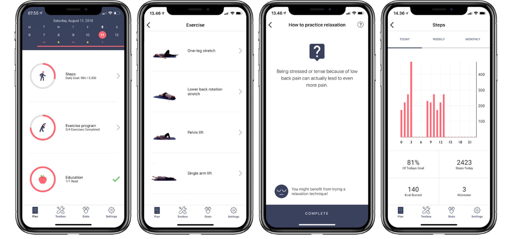

# Agenda

- PL Themenverteilung -\> geklärt?

- 2-Minuten-Rückblick

- PVL

- Etherpad-Aktivität: Bewegungsangebote und Apps

- Forschungsergebnisse zur Effektivität von Smartphone-Interventionen

- Webseitenerstellung mit Quarto

- Evtl. Vorstellung "Humanoo" und Projekt "ViRAL"

# 2-Minuten-Rückblick

- Messung von PA: Ein Kontinuum von hoher Validität und hohem Aufwand (Kriteriumsmethoden) über mittelmäßige Validität und mittlemäßigen Aufwand (Direkte Methoden) bishin zu geringer Validität und geringem Aufwand (Indirekte Methoden)

- Konstrukte: Selbstwirksamkeit (der "Katalysator"), Positiver Affekt (der "Motivator"), Negativer Affekt (Rückfallrisiko), Stolz (das "Barometer"), Attribution (Umgang mit Erfolg und Misserfolg).

  - Messung mit validierten Fragebögen

- Kultursensible Interventionen: Kulturvergleichende Psychologie // das multikulturelle Selbst

  - Praxis: Einfachheit, Zugänglichkeit, Vernetzung

# Prüfungsvorleistung

Thema: Online-Einsatz eines psychometrischen Fragebogens

# Bewegungsangebote und Apps

Sucht online nach Apps, Programmen oder sonstigen Angeboten für die breite Masse, die damit werben, Bewegung zu fördern oder darüber zu informieren (5-10 Minuten).

z.B: <https://www.techbook.de/mobile-lifestyle/apps/sport-apps>

oder andere, euch bekannte Angebote.

Wie wird hier versucht, auf die sportliche Aktivität Einfluss zu nehmen? Sammelt im Etherpad.

**Hinweis:** Als Teil einer professionellen Intervention sollten solche Angebote nur direkt genutzt werden, wenn sie theoriebasiert und durch Evidenz gestützt sind. Viele Ideen hier könnten allerdings nach entsprechender theoretischer Einbettung und Evaluation genutzt werden.

## Zentrale Erkenntnisse: @Domin2021 (5min)

- **Theorie-Defizit:** Viele Interventionen scheitern an mangelnder theoretischer Fundierung (sog. „Black Box“-Problematik).
- **Wirksamkeit durch BCTs:** Erfolg korreliert stark mit dem gezielten Einsatz von *Behavior Change Techniques* (z.B. Feedback, Zielsetzung, Monitoring).
- **Adhärenz-Herausforderung:** Das Nutzerengagement sinkt über die Zeit drastisch; langfristige Bindung bleibt die kritische Hürde.
- **Qualitätslücke:** Häufig mangelhafte methodische Dokumentation erschwert die Vergleichbarkeit und Evidenzbewertung.

# Beispiel Web-basierte Intervention: SelfBACK [@Svendsen2022]

# Webseitenerstellung mit Quarto

## Setup

- Voraussetzungen:
  - Programmiersprache R und [RStudio](https://posit.co/download/rstudio-desktop) mit der Erweiterung "[Quarto](https://quarto.org/docs/download/index.html)"
  - Account bei [Posit connect cloud](https://connect.posit.cloud/home)
- [Schritte](https://quarto.org/docs/websites/): File → New Project → New directory → Quarto Website
- [Online stellen](https://quarto.org/docs/publishing/posit-connect-cloud.html): `quarto publish posit-connect-cloud` im Terminal
- **Zeit zum eigenen Experimentieren und Troubleshooting**

Beispiele für solche Seiten: <https://interventionmapping.com/> (Intervention Mapping Homepage!)

## Eigenes Experimentieren

Weitere Möglichkeiten:

- Bilder: <https://quarto.org/docs/authoring/figures.html>

- Videos: <https://quarto.org/docs/authoring/videos.html>

- Themes und CSS-Styling: <https://quarto.org/docs/output-formats/html-themes.html>

- Andere Formate: PDF, Word und co. <https://quarto.org/docs/output-formats/all-formats.html>

- Zitation: <https://quarto.org/docs/authoring/citations.html>

## evtl. Vorstellung des Anti-Doping Projekts "ViRAL"

[Link zur Projektseite](https://viraltheproject.aau.dk/index.php/project-details/)

## evtl. App-Vorstellung "Humanoo"

(externe Präsentation)

# Literaturverzeichnis

::: refs
:::
