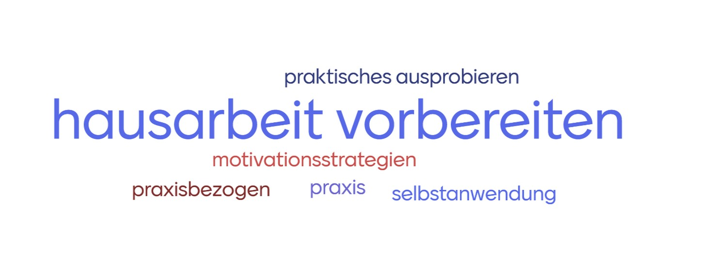

# 



#


# Agenda

- PVL (Gruppe A: Carolin, Gruppe B: keine)
- Input zu IM Schritt 2
- Arbeitsblatt
- Kurze Präsentation und live-Feedback

```{r setup}
#if (!requireNamespace("needs"   )) install.packages("needs")
#if (!requireNamespace("excelbib")) install_github("Enno-W/excelbib")
#needs("excelbib", "xfun")
#xlsx_to_bib(from_root("References.xlsx"))
```

# PVL

Thema: Online-Einsatz eines psychometrischen Fragebogens


## Erstellen von Programmzielen: Die Logik der Veränderung

- **Wechsel der Perspektive:** Weg vom Problem (Bedarfsanalyse), hin zur Lösung.
- **Ziel:** Festlegen, was sich konkret ändern muss, um die Gesundheit zu verbessern.

::: notes
- Hier findet der entscheidende Shift statt: Wir fragen nicht mehr "Was ist kaputt?", sondern "Was soll wie funktionieren?".
- Wichtig für die Studierenden: Die Basis sind die Programmziele am Ende der Bedarfsanalyse.
:::

## Unterscheidung der Ziele

1.  **Verhaltensziel:** Das Endergebnis (z. B. "Sich in der Pause bewegen").
2.  **Handlungsziel (*Performance Objective*):** Teilabschnitte des Verhaltens (z. B. "Mit Mitschüler:innen Bewegungsspiele ausmachen", "Passende Kleidung für Bewegung mitbringen bzw. anziehen").
3.  **Umweltziel:** Veränderungen im Umfeld (z. B. "Zusätzliche 60 Quadratmeter Grünflächen auf dem Pausenhof").
4.  **Veränderungsziel (*Change Objective*):** Wie muss sich eine Determinante (Wissen, Einstellung) ändern, um ein Handlungsziel zu erreichen? z.B. "Zielgruppe ist mit mindestens fünf verschiedenen Bewegungsspielen vertraut", "Haben eine positive Einstellung zu Sport in der Pause".

- !Wichtig!: Positive Formulierung. z.B. "Kinder bewegen sich in der Pause" anstatt "Kinder sitzen nicht in der Pause" 


::: notes
- Handlungsziele sind oft eine Abfolge von Einzelschritten. - Umweltziele betreffen Agierende (z.B. Bar-Management), nicht die Zielgruppe selbst. 
:::

## Modell der Veränderung

- Angenommene Wirkrichtung von links nach rechts, Reihenfolge der Erarbeitung aber von rechts nach links


## Die Matrix der Veränderungsziele

- Das Herzstück von Schritt 2: **Handlungsziele** $\times$ Determinanten.
- Jede Zelle beantwortet die Frage: *"Was muss sich bei Determinante X (z. B. Selbstwirksamkeit) ändern, damit Handlungsziel Y erreicht wird?"*

| Handlungsziel | Einstellung | Selbstwirksamkeit |
|:-----------------------|:-----------------------|:-----------------------|
| **...Aktivität in der Mittagspause** | Äußert sich positiv zu Bewegung während der Mittagspause. | Zeigt Vertrauen, geeignete Aktivitäten während der Mittagspause zu finden |

## Überlegungen zur Matrix

- verschiedene Level des ökosystemischen Ansatzes!!
- evtl. Subgruppen (verschiedene Entwicklungsstufen, Stufen des TTM, etc.)
- Für die Hausarbeit: Verschiedene Level und evtl. Subgruppen können in einer Matrix zusammengefasst werden. 

## Formulierungslogik für Veränderungsziele (COs)

### Die goldene Regel: Präzise und handlungsorientiert
- Jedes Veränderungsziel beginnt zwingend mit einem *Verb*, das die intendierte psychologische oder funktionale Aktion konkret (nicht schwammig) definiert.
- **Aktionsverb** + **Kontext/Bedingung** + **Rückbezug auf das Handlungsziel (PO)**
- z.B: *„Die Abteilungsleiter:innen kommunizieren (Aktionsverb) zu Beginn von Teambesprechungen explizit die Erlaubnis und den Wunsch nach Bewegungspausen (Kontext), um im Team die soziale Akzeptanz für das Aufstehen während der Arbeitszeit zu normalisieren (Rückbezug auf das PO).“*
- Damit gute Brücke zu Schritt 3

::: notes
- Machen Sie den Studierenden klar: Schwammige Verben wie „wissen“ oder „verstehen“ funktionieren hier nicht.
:::

# Übung: Matrix-Entwurf

Bearbeitet hierzu das Arbeitsblatt.
--> Direktes live Feedback in der Gruppe

::: notes
- Die Studierenden sollen hier zum ersten Mal die "Logik der Veränderung" anwenden.
- Hilfestellung: Die Frage "Warum/Wie?" nutzen.
:::

::: notes
Im nächsten Schritt bewegen wir uns vom Problem zur Reduzierung des Problems. Wir fragen uns "Wer muss was tun und warum?". Haben wir in Schritt eins festgestellt, dass Studierende nur selten Uni-eigene Sportangebote wahrnehmen, definieren wir hier, was sie stattdessen tun sollen. Wir definieren hier Ziele, und das nicht nur für die Studierenden (die Zielpopulation), sondern auch für die Leute, die auf Umweltbedingungen einwirken können, also Führungspersonen der Uni. Hier werden drei Arten von Zielen definiert, Veränderungsziele, Handlungsziele und Verhaltensziele. Zuerst die Verhaltensziele. Hier definieren wir, was wir am Ende für ein Verhalten sehen wollen, z.B. dass mindestens 50% der Studierenden an einem Hochschulsport-Kurs teilnehmen. Dieses Ziel teilen wir dann in Handlungsziele auf. Ein Handlungsziel hier wäre, dass diese 50% sich für einen Kurs einschreiben und an diesem regelmäßig teilnehmen. Hier sind die Determinanten wieder wichtig, veränderbare Faktoren, die einen kausalen Einfluss auf die Handlungsziele haben. So ein Determinant könnte das Ausmaß an Werbung für die Sportangebote sein. In unserem Beispiel könnte dann ein Veränderungsziel sein, dass kostenlose Sportangebote der Uni in allen Mensas beworben werden. Handlungsziele für verantwortliche Personen im Hochschulsport ist dann, Werbematerialien für die Mensas zu erstellen und dort auszulegen. Entsprechendes Veränderungsziel für die Studierenden könnten also sein, dass Werbematerial in den Mensas ausliegt (Das hat nämlich einen Einfluss auf deren Handlungsziel). Für Agierende im Hochschulsport könnte ein Veränderungsziel sein, dass entsprechende Mittel für die Werbung bewilligt werden.
:::

# Literaturverzeichnis

::: refs
:::
