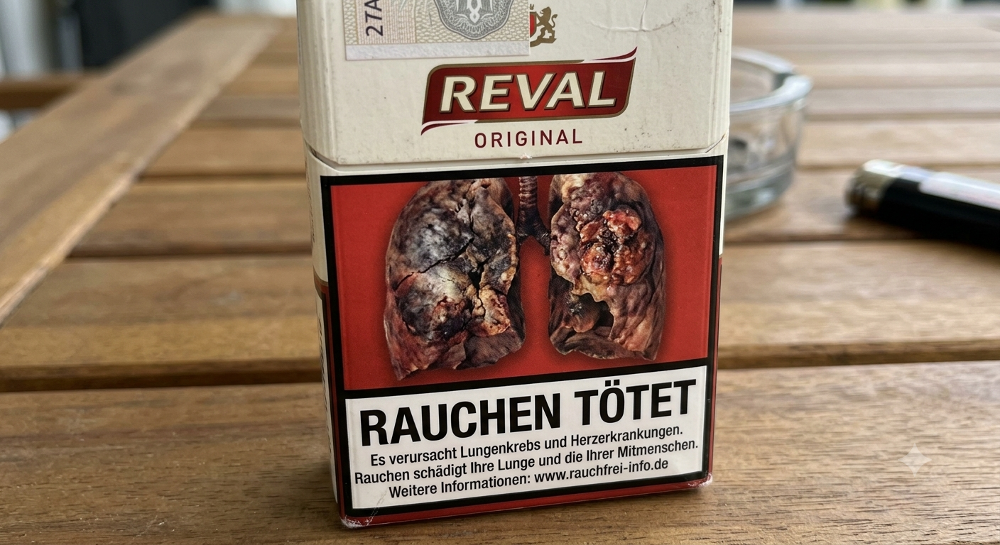

```{r setup}
# if (!requireNamespace("needs"   )) install.packages("needs")
# if (!requireNamespace("excelbib")) install_github("Enno-W/excelbib")
# needs("excelbib", "xfun")
 #xlsx_to_bib(from_root("References.xlsx"))
```

# Intervention Mapping Schritt 3 nach @Bartholomew2006

# Agenda

- PVL (Gruppe A: Keine; Gruppe B: Jakob & Jakob)
- Input zu Methoden und praktischen Anwendungen
- Verständis-Check im Mini-Quiz
- Betreute Arbeit an der Hausarbeit-Konzipierung

## Theoretische Methoden und praktische Anwendungen

::: notes
- In Schritt 2 haben wir festgelegt, WAS sich ändern muss.
- In Schritt 3 legen wir fest, WIE wir das erreichen.
- Wichtig: Wir raten nicht, wir nutzen Evidenz.
:::

1.  **Theoretische Methode:** Allgemeine, theoriebasierte Technik (z. B. *Modeling* oder *Diskussion*).
2.  **Praktische Anwendung:** Die spezifische Übersetzung für die Zielgruppe (z. B. ein Video eines Reha-Patienten oder ein gemeinsames Training).
3.  **Wirkparameter:** Bedingungen, unter denen die Methode überhaupt erst wirken kann.

::: notes
- Beispiel Modeling: Es reicht nicht, IRGENDJEMANDEN zu zeigen.
- Das Model muss relevant sein (Wirkparameter).
:::

## Schockbilder als Intervention



(Ki generiertes Bild)

## (Negativ)beispiel Wirkparameter

- **Beispiel Furchtappelle (Schreckbilder):**
  - Idee: Angst abschrecken (Emotionale Erregung).
  - **Vergessene Wirkparameter:** Hohe **Selbstwirksamkeit** klare Handlungslösung angeboten wird.
  - **Folge:** Defensive Reaktionen (Leugnung, Ignorieren), besonders bei Suchtverhalten. –\> Bei Jungen Nichtraucher:innen wirksam, wenig aber bei bereits rauchenden Personen [@westdeutsche_zeitung_schockbilder_2018].

::: notes
- Das ist ein klassisches Beispiel für gut gemeinte, aber schlecht geplante Interventionen.
- Ohne Selbstwirksamkeit führt Angst zu Abwehr, nicht zu Verhaltensänderung.
:::

## Methoden für den Sportkontext [Nach @Bartholomew2006]

- **Modeling (*Sozial-kognitive Theorie*; Tabelle 7.3):** Demonstration des Zielverhaltens durch adäquate Bezugspersonen.
  * *Wirkparameter:* Die Zielgruppe muss sich mit dem Modell identifizieren können (daher eher *Coping Model* statt fehlerfreies *Mastery Model*).
  * *Sport-Beispiel:* Ein Video zeigt eine Kollegin, die schildert, wie sie trotz Trägheit die aktive Pause im Büro startet.
- **Belief Selection (*Reasoned Action*; Tabelle 7.5):** Gezieltes Stärken positiver, im Alltag relevanter Einstellungen zu Sport und Entkräften von Barrieren.
  * *Wirkparameter:* Die Argumente müssen für die Lebenswelt hochgradig relevant, neu und von einer vertrauenswürdigen Quelle sein.
  * *Sport-Beispiel:* Kursteilnehmenden wird aufgezeigt, dass bereits 10 Minuten moderate Bewegung die Nachmittagsmüdigkeit sofort senken.

## Methoden für den Sportkontext (Beispiele aus der BCT)

- **Handlungsplanung (*Action planning* — BCT 1.4):** Detailreiches Planen von Kontext, Zeit und Intensität (z. B. feste Lauf-Termine direkt als Blocker in den Outlook-Kalender der Mitarbeitenden eintragen oder verbindliche Bewegungszeiten im schulischen Stundenplan verankern).
- **Selbstbeobachtung des Verhaltens (*Self-monitoring of behavior* — BCT 2.3):** Eigenständiges Erfassen der Aktivität über Tools (z. B. Durchführung einer App-basierten Schrittzähler-Challenge zwischen verschiedenen Abteilungen einer Firma oder Nutzen eines analogen Bewegungstagebuchs im Sportunterricht).
- **Umstrukturierung der physischen Umwelt (*Restructuring the physical environment* — BCT 12.1):** Die Infrastruktur so verändern, dass Barrieren abgebaut werden (z. B. Anschaffung von höhenverstellbaren Schreibtischen/Stehpulten im Betrieb).

::: notes
- Coping Model vs. Mastery Model: Ein Patient, der zeigt, wie er trotz Knieschmerzen mit dem Training beginnt, ist effektiver als ein Fitness-Model.
:::

## Praktische Anwendung: Umstrukturierung der physischen Umwelt.

[Piano Stairs](https://www.youtube.com/watch?v=2lXh2n0aPyw)

Plenum-Frage: Welche Determinante wird hier wohl adressiert?

## Von der Theorie zur Matrix

Um sicherzustellen, dass jedes Ziel adressiert wird, ordnen wir:

1.  **Veränderungsziel**

2.  **Methode**

3.  **Anwendung**

einander zu.

::: notes
- Hinweis auf "Snack Healthy" Beispiel: Zeigen, wie Peer-Videos (Anwendung) die Methode des sozialen Vergleichs nutzen.
:::

## Beispielhafter **Auszug** aus einer Matrix für Methoden und Anwendungen

| Determinante | Veränderungsziel | Methode | Anwendung |
|:-----------------|:-----------------|:-----------------|:-----------------|
| **Einstellung** | **A:** Äußern sich positiv über kurze Bewegungspausen im Alltag.<br>**B:** Äußern sich positiv über das Nutzen der Treppe statt des Aufzugs.<br>**C:** Äußern sich positiv über das Einplanen aktiver Wegezeiten. | **Direkte Erfahrung**<br>*(Veränderungsziele: A, B)*<br><br>**Argumente**<br>*(Veränderungsziele: A, B, C)* | Eine kurze, angeleitete "Schnupper-Pause" direkt im der Firma anbieten, bei der die Teilnehmenden die Effekte einer aktiven Pause spüren.<br><br>Video in einem Team-Meeting zeigen: Peers/Kolleg\*innen berichten in kurzen Statements, warum sie die Treppe nutzen und wie sich dadurch ihre Alltagsfitness verbessert hat. |

# Übung: Methoden-Matching

Bearbeitet hierzu das Arbeitsblatt

::: notes
- Beispiel: Ziel "Traut sich zu, zu Hause Kniebeugen zu machen". Methode: Modeling + Guided Practice. Anwendung: Physiotherapeut macht es vor, Patient macht es nach, bekommt Feedback.
:::

# Literaturverzeichnis

::: refs
:::
